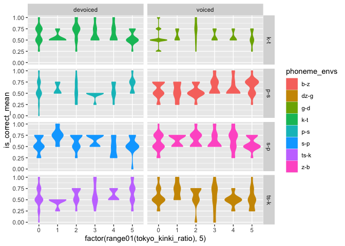

Allophone
================

-   異音の分析なんだが、ツッコミから始まるアンチパターンに陥っている。
-   ポジティブな、理論的な貢献を視座高くして考えるべき。
-   行動実験の結果にはノイズが乗っているから、新しく要因とするには不安…

todo

1.  被験者ごとのデータをまとめる

-   産出課題: 無声化率(環境毎)
-   近畿の居住年数

1.  被験者ごとのデータをまとめる

-   無声化
    -   AXB
    -   判定課題
-   トーンの復元

タスクの確認

item\_id がないのは練習問題

-   production
-   axb
    -   item\_id でタスクが分かれる
-   cat
    -   item\_id でタスクが分かれる
-   rate(音としてどれくらい良いか)
    -   item\_id でタスクが分かれる

無声化
<https://docs.google.com/document/d/1OKkkZ4sELLtTBjiBWUG_P37EsWdFsidrGv0eOqiwIic/edit?usp=sharing>

``` r
item_list <- read_csv("../src/list/axb_list.csv") %>%
  select(c(item_id, type, condition, correct, item_a, item_x, item_b, c1, c2))
```

    ## 
    ## ─ Column specification ────────────────────────────
    ## cols(
    ##   .default = col_character(),
    ##   item_id = col_double(),
    ##   pair = col_double(),
    ##   speaker_1 = col_double(),
    ##   speaker_2 = col_double(),
    ##   speaker_3 = col_double()
    ## )
    ## ℹ Use `spec()` for the full column specifications.

``` r
subject_info_sone <- read_csv("csv/illusory-vowel-keihan.csv") %>%
  extract_columns(data_src = "sone")
```

    ## 
    ## ─ Column specification ────────────────────────────
    ## cols(
    ##   .default = col_character(),
    ##   run_id = col_double(),
    ##   condition = col_double(),
    ##   trial_index = col_double(),
    ##   time_elapsed = col_double(),
    ##   recorded_at = col_datetime(format = ""),
    ##   platform_version = col_double()
    ## )
    ## ℹ Use `spec()` for the full column specifications.

    ## Warning: 1766 parsing failures.
    ##  row              col               expected  actual                            file
    ## 1769 platform_version no trailing characters 10_15_7 'csv/illusory-vowel-keihan.csv'
    ## 1770 platform_version no trailing characters 10_15_7 'csv/illusory-vowel-keihan.csv'
    ## 1771 platform_version no trailing characters 10_15_7 'csv/illusory-vowel-keihan.csv'
    ## 1772 platform_version no trailing characters 10_15_7 'csv/illusory-vowel-keihan.csv'
    ## 1773 platform_version no trailing characters 10_15_7 'csv/illusory-vowel-keihan.csv'
    ## .... ................ ...................... ....... ...............................
    ## See problems(...) for more details.

``` r
subject_info_cw <- read_csv("csv/illusory-vowel-keihan-cw.csv") %>%
  extract_columns(data_src = "cw")
```

    ## 
    ## ─ Column specification ────────────────────────────
    ## cols(
    ##   .default = col_character(),
    ##   run_id = col_double(),
    ##   condition = col_double(),
    ##   trial_index = col_double(),
    ##   time_elapsed = col_double(),
    ##   recorded_at = col_datetime(format = ""),
    ##   platform_version = col_double()
    ## )
    ## ℹ Use `spec()` for the full column specifications.

    ## Warning: 5319 parsing failures.
    ##  row              col               expected  actual                               file
    ## 5911 platform_version no trailing characters 10_15_7 'csv/illusory-vowel-keihan-cw.csv'
    ## 5912 platform_version no trailing characters 10_15_7 'csv/illusory-vowel-keihan-cw.csv'
    ## 5913 platform_version no trailing characters 10_15_7 'csv/illusory-vowel-keihan-cw.csv'
    ## 5914 platform_version no trailing characters 10_15_7 'csv/illusory-vowel-keihan-cw.csv'
    ## 5915 platform_version no trailing characters 10_15_7 'csv/illusory-vowel-keihan-cw.csv'
    ## .... ................ ...................... ....... ..................................
    ## See problems(...) for more details.

``` r
subject_info <- rbind(subject_info_sone, subject_info_cw)

results <- rbind(
  read_csv("csv/illusory-vowel-keihan.csv") %>% mutate(data_src = "sone"),
  read_csv("csv/illusory-vowel-keihan-cw.csv") %>% mutate(data_src = "cw")
) %>%
  filter(task == "axb") %>%
  left_join(subject_info, by = c("run_id", "data_src")) %>%
  select(c(run_id, item_id, is_correct, rt, span_kinki, span_tokyo, span_unknown, age, data_src, correct)) %>%
  mutate(item_id = as.numeric(item_id)) %>%
  mutate(rt = as.numeric(rt)) %>%
  mutate(item_id = as.numeric(item_id)) %>%
  mutate(is_correct = is_correct == "true") %>%
  # boolにしている
  drop_na() %>%
  mutate(
    span_tokyo_span_kinki = span_tokyo - span_kinki,
    tokyo_kinki_ratio = (span_tokyo - span_kinki) / age
  ) %>%
  filter(age > 18) %>%
  merge(item_list, on = "item_id") %>%
  filter(type == "target") %>%
  group_by(c1, c2, run_id, data_src) %>%
  mutate(
    is_correct_mean = mean(is_correct),
    phoneme_envs = paste0(c1, "-", c2),
    subject_id = paste0(data_src, "-", run_id)
  ) %>%
  mutate(
    pair = case_when(
      phoneme_envs %in% c("s-p", "z-b") ~ "s-p",
      phoneme_envs %in% c("p-s", "b-z") ~ "p-s",
      phoneme_envs %in% c("k-t", "g-d") ~ "k-t",
      phoneme_envs %in% c("ts-k", "dz-g") ~ "ts-k"
    ),
  )
```

    ## 
    ## ─ Column specification ────────────────────────────
    ## cols(
    ##   .default = col_character(),
    ##   run_id = col_double(),
    ##   condition = col_double(),
    ##   trial_index = col_double(),
    ##   time_elapsed = col_double(),
    ##   recorded_at = col_datetime(format = ""),
    ##   platform_version = col_double()
    ## )
    ## ℹ Use `spec()` for the full column specifications.

    ## Warning: 1766 parsing failures.
    ##  row              col               expected  actual                            file
    ## 1769 platform_version no trailing characters 10_15_7 'csv/illusory-vowel-keihan.csv'
    ## 1770 platform_version no trailing characters 10_15_7 'csv/illusory-vowel-keihan.csv'
    ## 1771 platform_version no trailing characters 10_15_7 'csv/illusory-vowel-keihan.csv'
    ## 1772 platform_version no trailing characters 10_15_7 'csv/illusory-vowel-keihan.csv'
    ## 1773 platform_version no trailing characters 10_15_7 'csv/illusory-vowel-keihan.csv'
    ## .... ................ ...................... ....... ...............................
    ## See problems(...) for more details.

    ## 
    ## ─ Column specification ────────────────────────────
    ## cols(
    ##   .default = col_character(),
    ##   run_id = col_double(),
    ##   condition = col_double(),
    ##   trial_index = col_double(),
    ##   time_elapsed = col_double(),
    ##   recorded_at = col_datetime(format = ""),
    ##   platform_version = col_double()
    ## )
    ## ℹ Use `spec()` for the full column specifications.

    ## Warning: 5319 parsing failures.
    ##  row              col               expected  actual                               file
    ## 5911 platform_version no trailing characters 10_15_7 'csv/illusory-vowel-keihan-cw.csv'
    ## 5912 platform_version no trailing characters 10_15_7 'csv/illusory-vowel-keihan-cw.csv'
    ## 5913 platform_version no trailing characters 10_15_7 'csv/illusory-vowel-keihan-cw.csv'
    ## 5914 platform_version no trailing characters 10_15_7 'csv/illusory-vowel-keihan-cw.csv'
    ## 5915 platform_version no trailing characters 10_15_7 'csv/illusory-vowel-keihan-cw.csv'
    ## .... ................ ...................... ....... ..................................
    ## See problems(...) for more details.

    ## Warning: Problem with `mutate()` input `item_id`.
    ## ℹ  強制変換により NA が生成されました 
    ## ℹ Input `item_id` is `as.numeric(item_id)`.

    ## Warning in mask$eval_all_mutate(dots[[i]]): 強制変換により NA が生成されました

アイテムリストのマージ

``` r
head(results, 100)
```

    ## # A tibble: 100 x 23
    ## # Groups:   c1, c2, run_id, data_src [100]
    ##    item_id correct run_id is_correct    rt span_kinki span_tokyo span_unknown
    ##      <dbl> <chr>    <dbl> <lgl>      <dbl>      <int>      <int>        <int>
    ##  1       1 a          189 TRUE       1217.         48          0            0
    ##  2       1 a          165 TRUE        448          53          0            0
    ##  3       1 a           30 FALSE      2109.          2         10           54
    ##  4       1 a           32 TRUE        166.         41          0            0
    ##  5       1 a          249 FALSE       632.          0         40            0
    ##  6       1 a          105 FALSE      1088.         35          0            0
    ##  7       1 a           19 TRUE       1027.          0         10           14
    ##  8       1 a           76 TRUE        521.          0         54            0
    ##  9       1 a          148 TRUE        877.          0          6           19
    ## 10       1 a          161 TRUE        409.          0         36            4
    ## # … with 90 more rows, and 15 more variables: age <int>, data_src <chr>,
    ## #   span_tokyo_span_kinki <int>, tokyo_kinki_ratio <dbl>, type <chr>,
    ## #   condition <chr>, item_a <chr>, item_x <chr>, item_b <chr>, c1 <chr>,
    ## #   c2 <chr>, is_correct_mean <dbl>, phoneme_envs <chr>, subject_id <chr>,
    ## #   pair <chr>

``` r
results$phoneme_envs %>% unique()
```

    ## [1] "s-p"  "k-t"  "g-d"  "p-s"  "b-z"  "ts-k" "dz-g" "z-b"

``` r
results %>%
  ggplot() +
  facet_grid(pair ~ condition) +
  geom_violin(aes(
    x = factor(range01(tokyo_kinki_ratio), 5),
    y = is_correct_mean,
    color = phoneme_envs,
    fill = phoneme_envs,
  ))
```

<!-- -->

全体的に有声音の環境ではアイテムの作成の難しさから弁別が用意になっているかもしれない。

-   まぁ普通に近畿で錯覚が増えていることにはならない
-   bzの方がps より錯覚が起きやすい

``` r
library(lmerTest)
```

    ## Loading required package: lme4

    ## Loading required package: Matrix

    ## 
    ## Attaching package: 'Matrix'

    ## The following objects are masked from 'package:tidyr':
    ## 
    ##     expand, pack, unpack

    ## 
    ## Attaching package: 'lmerTest'

    ## The following object is masked from 'package:lme4':
    ## 
    ##     lmer

    ## The following object is masked from 'package:stats':
    ## 
    ##     step

``` r
model <- lmer(
  is_correct_mean ~
  condition * pair + tokyo_kinki_ratio + (1 | subject_id),
  data = results
)

# 居住歴の効果はない(トーンの錯覚とは対照的)
summary(model)
```

    ## Linear mixed model fit by REML. t-tests use Satterthwaite's method [
    ## lmerModLmerTest]
    ## Formula: is_correct_mean ~ condition * pair + tokyo_kinki_ratio + (1 |  
    ##     subject_id)
    ##    Data: results
    ## 
    ## REML criterion at convergence: -1164.3
    ## 
    ## Scaled residuals: 
    ##     Min      1Q  Median      3Q     Max 
    ## -3.2922 -0.5488 -0.0734  0.7145  2.5987 
    ## 
    ## Random effects:
    ##  Groups     Name        Variance Std.Dev.
    ##  subject_id (Intercept) 0.005332 0.07302 
    ##  Residual               0.032337 0.17983 
    ## Number of obs: 2272, groups:  subject_id, 71
    ## 
    ## Fixed effects:
    ##                            Estimate Std. Error         df t value Pr(>|t|)    
    ## (Intercept)               6.196e-01  1.375e-02  2.971e+02  45.075  < 2e-16 ***
    ## conditionvoiced          -3.169e-02  1.509e-02  2.194e+03  -2.100  0.03584 *  
    ## pairp-s                  -3.521e-02  1.509e-02  2.194e+03  -2.333  0.01972 *  
    ## pairs-p                  -4.225e-02  1.509e-02  2.194e+03  -2.800  0.00516 ** 
    ## pairts-k                 -2.817e-02  1.509e-02  2.194e+03  -1.867  0.06208 .  
    ## tokyo_kinki_ratio         1.091e-02  1.201e-02  6.900e+01   0.908  0.36685    
    ## conditionvoiced:pairp-s   4.930e-02  2.134e-02  2.194e+03   2.310  0.02099 *  
    ## conditionvoiced:pairs-p   6.338e-02  2.134e-02  2.194e+03   2.970  0.00301 ** 
    ## conditionvoiced:pairts-k -3.521e-03  2.134e-02  2.194e+03  -0.165  0.86897    
    ## ---
    ## Signif. codes:  0 '***' 0.001 '**' 0.01 '*' 0.05 '.' 0.1 ' ' 1
    ## 
    ## Correlation of Fixed Effects:
    ##               (Intr) cndtnv parp-s pars-p prts-k tky_k_ cndtnvcd:prp-
    ## conditinvcd   -0.549                                                 
    ## pairp-s       -0.549  0.500                                          
    ## pairs-p       -0.549  0.500  0.500                                   
    ## pairts-k      -0.549  0.500  0.500  0.500                            
    ## toky_knk_rt   -0.007  0.000  0.000  0.000  0.000                     
    ## cndtnvcd:prp-  0.388 -0.707 -0.707 -0.354 -0.354  0.000              
    ## cndtnvcd:prs-  0.388 -0.707 -0.354 -0.707 -0.354  0.000  0.500       
    ## cndtnvcd:prt-  0.388 -0.707 -0.354 -0.354 -0.707  0.000  0.500       
    ##               cndtnvcd:prs-
    ## conditinvcd                
    ## pairp-s                    
    ## pairs-p                    
    ## pairts-k                   
    ## toky_knk_rt                
    ## cndtnvcd:prp-              
    ## cndtnvcd:prs-              
    ## cndtnvcd:prt-  0.500

-   voiced になると下がる(ベースライン)
    -   p-s, s-p では voiced になると上がる(先行研究と同じ)
    -   ts-k は下がる, k-t も下がる（おそらくベースライン）
-   p-s や p-s、ts-k は下がる
    -   摩擦や破裂、といった要素でモデリングしたほうが良さそう
