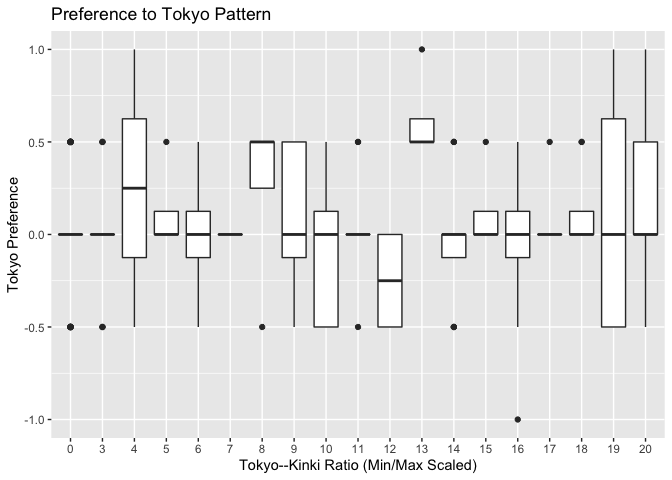
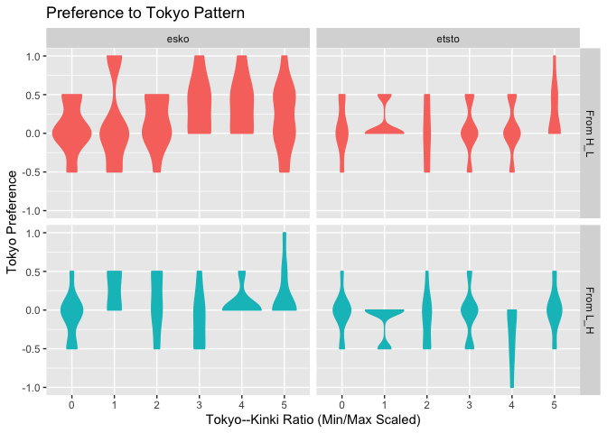
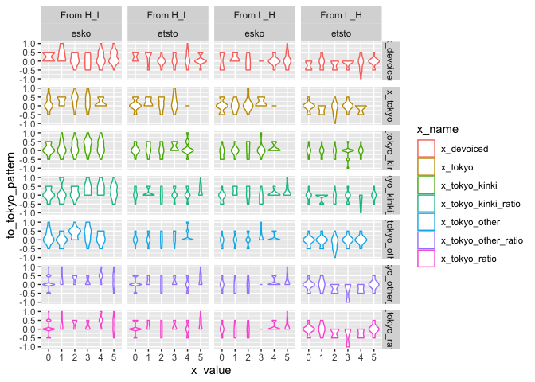

Pitch Delta
================

-   [概要](https://docs.google.com/document/d/1rk5MHMvD5-6SWT7H2nkc-r7v3KvH-dzt_OdftNrDe-I/edit?usp=sharing)
-   [作業説明](https://docs.google.com/document/d/1U3FCDh8NETS-9mWDLfTU_0mZx9jJpFgkisukI58nV64/edit?usp=sharing)

行う分析(可視化, 統計)

-   独立変数
    -   被験者要因(居住歴\|無声化率)
        -   *居住歴* (*tokyo\_kinki\_ratio*, span\_kinki,
            span\_kinki\_span\_other, span\_kinki\_span\_tokyo
            (閾値が面倒))
        -   無声化率: devoicing\_by\_subj -&gt; 効果なし
    -   ランダム効果
        -   アイテム要因(東京\|アクセントタイプ:
            ただしアイテムの効果かもしれない)
        -   地域ごと: HLL+LHH OR HHL+LLH
        -   アクセントタイプごと: HLL OR LHH OR HHL OR LLH
            (分析が難しい. 差の差の分析にする)
        -   音素タイプ
-   従属変数(メインの結果をわかりやすく)
    -   正答率の差 (HHL-HLL, LLH-LHH): わかりづらいな。
        -   &lt;- 東京アクセントへの選好性/錯覚のしやすさ ((-HLL) -
            (-HHL))
    -   正答率(錯覚しないか)
    -   反応時間の差

方針

1.  全てのカラムをDFに落とし込む
2.  formula で可視化と分析を実施

TODO

-   [x] アクセントパターンでの分析
-   [x] 被験者ごとに差を見る(HHL-HLLのスコア、など)
    -   東京バイアス、とする。
-   [x] `正答率~近畿` (Xは2パターンある。formulaかなにかで回す方がよい)
    -   「正答率」は aとbのどちらに寄せるか。
        -   平均で(前と後ろの選好性を平均する) -掛け算
-   [ ] 外れ値の除外 (正答率、反応時間)
    -   正答率に関しては適当に受けるとチャンスレベルになるので問題
    -   分析対象を変えていくよりは、行う分析を決めて一気に進めたほうがよい　

### データ整形

``` r
# 上手く行かない場合はconsoleでDLする
# remove.packages(c("StanHeaders", "rstan"))
# install.packages("StanHeaders", repos = c("https://mc-stan.org/r-packages/", getOption("repos")))
# install.packages("rstan", repos = c("https://mc-stan.org/r-packages/", getOption("repos")))
```

``` r
unique(results_by_subject$age)
```

    ##  [1] 27 36 42 30 23 28 48 19 37 33 41 50 32 53 66 24 40 34 38 47 25 55 21 57 31
    ## [26] 65 26 56 43 35 46 51 54 29

``` r
head(results_by_subject)
```

    ## # A tibble: 6 x 22
    ##   run_id data_src item  to_tokyo_pattern phoneme pitch_from voiced subj_id
    ##    <dbl> <chr>    <chr>            <dbl> <chr>   <chr>       <dbl> <chr>  
    ## 1    152 cw       etst…              0.5 etsto   From H_L   0.0417 152_ru…
    ## 2    152 cw       esko…              0   esko    From H_L   0.0417 152_ru…
    ## 3    152 cw       etst…              0   etsto   From L_H   0.0417 152_ru…
    ## 4    152 cw       esko…              0   esko    From L_H   0.0417 152_ru…
    ## 5    128 sone     etst…              0   etsto   From H_L   0.167  128_00…
    ## 6    128 sone     esko…              0.5 esko    From H_L   0.167  128_00…
    ## # … with 14 more variables: input_id <chr>, span_tokyo <dbl>,
    ## #   span_kinki <dbl>, age <dbl>, span_unknown <dbl>, devoiced <dbl>,
    ## #   span_tokyo_span_kinki <dbl>, span_tokyo_span_other <dbl>,
    ## #   span_kinki_span_tokyo <dbl>, span_kinki_span_other <dbl>,
    ## #   tokyo_kinki_ratio <dbl>, tokyo_other_ratio <dbl>, tokyo_ratio <dbl>,
    ## #   item_id <chr>

### 可視化

複数の列を作成して可視化

1.  基本情報(results\_pitch):
    被験者間実験なので分散が大きい(Appendix行き)

-   条件ごとの精度
-   被験者ごとの精度
-   アイテムごとの精度

1.  統計(results\_by\_subject)

## 東京との接触

### 可視化

#### シンプル

``` r
# H_L だと分布がちょっと下におちて、tokyo_pref, つまりXが少なくなっている。
results_by_subject %>%
  ggplot() +
  geom_boxplot(aes(x = factor(range01(tokyo_kinki_ratio), 20), y = to_tokyo_pattern)) +
  # geom_violin(aes(x=factor(range01(tokyo_kinki_ratio), 5), y=to_tokyo_pattern))+
  theme(legend.position = "none") +
  labs(
    title = "Preference to Tokyo Pattern",
    x = "Tokyo--Kinki Ratio (Min/Max Scaled)",
    y = "Tokyo Preference"
  )
```

<!-- -->

``` r
ggsave(paste0("artifact/preference_by_tokyo_kinki_ratio_simple.png"),
  unit = "cm", width = 8, height = 8
)
```

#### アイテムごと

``` r
# H_L だと分布がちょっと下におちて、tokyo_pref, つまりXが少なくなっている。
results_by_subject %>%
  ggplot() +
  facet_grid(pitch_from ~ phoneme) +
  # geom_boxplot(aes(x=factor(range01(tokyo_kinki_ratio), 5),
  #                 y=to_tokyo_pattern, color=pitch_from))+
  geom_violin(aes(
    x = factor(range01(tokyo_kinki_ratio), 5),
    y = to_tokyo_pattern, color = pitch_from, fill = pitch_from
  )) +
  theme(legend.position = "none") +
  labs(
    title = "Preference to Tokyo Pattern",
    x = "Tokyo--Kinki Ratio (Min/Max Scaled)",
    y = "Tokyo Preference"
  )
```

<!-- -->

``` r
ggsave(paste0("artifact/preference_by_tokyo_kinki_ratio.png"),
  unit = "cm", width = 8, height = 8
)
```

## 分析

``` r
head(results_by_subject)
```

    ## # A tibble: 6 x 22
    ##   run_id data_src item  to_tokyo_pattern phoneme pitch_from voiced subj_id
    ##    <dbl> <chr>    <chr>            <dbl> <chr>   <chr>       <dbl> <chr>  
    ## 1    152 cw       etst…              0.5 etsto   From H_L   0.0417 152_ru…
    ## 2    152 cw       esko…              0   esko    From H_L   0.0417 152_ru…
    ## 3    152 cw       etst…              0   etsto   From L_H   0.0417 152_ru…
    ## 4    152 cw       esko…              0   esko    From L_H   0.0417 152_ru…
    ## 5    128 sone     etst…              0   etsto   From H_L   0.167  128_00…
    ## 6    128 sone     esko…              0.5 esko    From H_L   0.167  128_00…
    ## # … with 14 more variables: input_id <chr>, span_tokyo <dbl>,
    ## #   span_kinki <dbl>, age <dbl>, span_unknown <dbl>, devoiced <dbl>,
    ## #   span_tokyo_span_kinki <dbl>, span_tokyo_span_other <dbl>,
    ## #   span_kinki_span_tokyo <dbl>, span_kinki_span_other <dbl>,
    ## #   tokyo_kinki_ratio <dbl>, tokyo_other_ratio <dbl>, tokyo_ratio <dbl>,
    ## #   item_id <chr>

### 東京居住歴のみ

#### LME

``` r
library(lmerTest)
```

    ## Loading required package: lme4

    ## Loading required package: Matrix

    ## 
    ## Attaching package: 'Matrix'

    ## The following objects are masked from 'package:tidyr':
    ## 
    ##     expand, pack, unpack

    ## 
    ## Attaching package: 'lmerTest'

    ## The following object is masked from 'package:lme4':
    ## 
    ##     lmer

    ## The following object is masked from 'package:stats':
    ## 
    ##     step

``` r
model <- lmer(
  to_tokyo_pattern ~
  tokyo_kinki_ratio + (1 | item_id),
  data = results_by_subject
)
# model <- lmer(
#   to_tokyo_pattern ~
#   tokyo_kinki_ratio + (1 | subj_id) + (1 | item_id),
#   data = results_by_subject
# )
# ?isSingular
summary(model)
```

    ## Linear mixed model fit by REML. t-tests use Satterthwaite's method [
    ## lmerModLmerTest]
    ## Formula: to_tokyo_pattern ~ tokyo_kinki_ratio + (1 | item_id)
    ##    Data: results_by_subject
    ## 
    ## REML criterion at convergence: 182.5
    ## 
    ## Scaled residuals: 
    ##      Min       1Q   Median       3Q      Max 
    ## -2.84690 -0.43232 -0.09774  0.83856  2.69873 
    ## 
    ## Random effects:
    ##  Groups   Name        Variance Std.Dev.
    ##  item_id  (Intercept) 0.01091  0.1045  
    ##  Residual             0.11505  0.3392  
    ## Number of obs: 248, groups:  item_id, 4
    ## 
    ## Fixed effects:
    ##                    Estimate Std. Error        df t value Pr(>|t|)  
    ## (Intercept)         0.05199    0.05650   3.00008   0.920    0.425  
    ## tokyo_kinki_ratio   0.05674    0.02761 243.00000   2.055    0.041 *
    ## ---
    ## Signif. codes:  0 '***' 0.001 '**' 0.01 '*' 0.05 '.' 0.1 ' ' 1
    ## 
    ## Correlation of Fixed Effects:
    ##             (Intr)
    ## toky_knk_rt -0.004

#### Bayes

-   アイテムと被験者を要因としてモデルを組む
-   ベイズファクターの分析は保留(勉強不足)

``` r
# install.packages("bayestestR")
library(brms)
```

    ## Loading required package: Rcpp

    ## Loading 'brms' package (version 2.16.3). Useful instructions
    ## can be found by typing help('brms'). A more detailed introduction
    ## to the package is available through vignette('brms_overview').

    ## 
    ## Attaching package: 'brms'

    ## The following object is masked from 'package:lme4':
    ## 
    ##     ngrps

    ## The following object is masked from 'package:stats':
    ## 
    ##     ar

``` r
# 切片のみ（帰無仮説）
model_0 <- brm(
  to_tokyo_pattern ~
  1 + (1 | subj_id) + (1 | item_id),
  data = results_by_subject,
  save_all_pars = TRUE,
  # prior = prior(cauchy(0,10),class=b),
  iter = 10000
)
```

    ## Warning: Argument 'save_all_pars' is deprecated. Please use argument 'all' in
    ## function 'save_pars()' instead.

    ## Compiling Stan program...

    ## Start sampling

    ## 
    ## SAMPLING FOR MODEL 'anon_model' NOW (CHAIN 1).
    ## Chain 1: 
    ## Chain 1: Gradient evaluation took 0.000151 seconds
    ## Chain 1: 1000 transitions using 10 leapfrog steps per transition would take 1.51 seconds.
    ## Chain 1: Adjust your expectations accordingly!
    ## Chain 1: 
    ## Chain 1: 
    ## Chain 1: Iteration:    1 / 10000 [  0%]  (Warmup)
    ## Chain 1: Iteration: 1000 / 10000 [ 10%]  (Warmup)
    ## Chain 1: Iteration: 2000 / 10000 [ 20%]  (Warmup)
    ## Chain 1: Iteration: 3000 / 10000 [ 30%]  (Warmup)
    ## Chain 1: Iteration: 4000 / 10000 [ 40%]  (Warmup)
    ## Chain 1: Iteration: 5000 / 10000 [ 50%]  (Warmup)
    ## Chain 1: Iteration: 5001 / 10000 [ 50%]  (Sampling)
    ## Chain 1: Iteration: 6000 / 10000 [ 60%]  (Sampling)
    ## Chain 1: Iteration: 7000 / 10000 [ 70%]  (Sampling)
    ## Chain 1: Iteration: 8000 / 10000 [ 80%]  (Sampling)
    ## Chain 1: Iteration: 9000 / 10000 [ 90%]  (Sampling)
    ## Chain 1: Iteration: 10000 / 10000 [100%]  (Sampling)
    ## Chain 1: 
    ## Chain 1:  Elapsed Time: 4.621 seconds (Warm-up)
    ## Chain 1:                3.86 seconds (Sampling)
    ## Chain 1:                8.481 seconds (Total)
    ## Chain 1: 
    ## 
    ## SAMPLING FOR MODEL 'anon_model' NOW (CHAIN 2).
    ## Chain 2: 
    ## Chain 2: Gradient evaluation took 2.8e-05 seconds
    ## Chain 2: 1000 transitions using 10 leapfrog steps per transition would take 0.28 seconds.
    ## Chain 2: Adjust your expectations accordingly!
    ## Chain 2: 
    ## Chain 2: 
    ## Chain 2: Iteration:    1 / 10000 [  0%]  (Warmup)
    ## Chain 2: Iteration: 1000 / 10000 [ 10%]  (Warmup)
    ## Chain 2: Iteration: 2000 / 10000 [ 20%]  (Warmup)
    ## Chain 2: Iteration: 3000 / 10000 [ 30%]  (Warmup)
    ## Chain 2: Iteration: 4000 / 10000 [ 40%]  (Warmup)
    ## Chain 2: Iteration: 5000 / 10000 [ 50%]  (Warmup)
    ## Chain 2: Iteration: 5001 / 10000 [ 50%]  (Sampling)
    ## Chain 2: Iteration: 6000 / 10000 [ 60%]  (Sampling)
    ## Chain 2: Iteration: 7000 / 10000 [ 70%]  (Sampling)
    ## Chain 2: Iteration: 8000 / 10000 [ 80%]  (Sampling)
    ## Chain 2: Iteration: 9000 / 10000 [ 90%]  (Sampling)
    ## Chain 2: Iteration: 10000 / 10000 [100%]  (Sampling)
    ## Chain 2: 
    ## Chain 2:  Elapsed Time: 3.952 seconds (Warm-up)
    ## Chain 2:                4.261 seconds (Sampling)
    ## Chain 2:                8.213 seconds (Total)
    ## Chain 2: 
    ## 
    ## SAMPLING FOR MODEL 'anon_model' NOW (CHAIN 3).
    ## Chain 3: 
    ## Chain 3: Gradient evaluation took 3.1e-05 seconds
    ## Chain 3: 1000 transitions using 10 leapfrog steps per transition would take 0.31 seconds.
    ## Chain 3: Adjust your expectations accordingly!
    ## Chain 3: 
    ## Chain 3: 
    ## Chain 3: Iteration:    1 / 10000 [  0%]  (Warmup)
    ## Chain 3: Iteration: 1000 / 10000 [ 10%]  (Warmup)
    ## Chain 3: Iteration: 2000 / 10000 [ 20%]  (Warmup)
    ## Chain 3: Iteration: 3000 / 10000 [ 30%]  (Warmup)
    ## Chain 3: Iteration: 4000 / 10000 [ 40%]  (Warmup)
    ## Chain 3: Iteration: 5000 / 10000 [ 50%]  (Warmup)
    ## Chain 3: Iteration: 5001 / 10000 [ 50%]  (Sampling)
    ## Chain 3: Iteration: 6000 / 10000 [ 60%]  (Sampling)
    ## Chain 3: Iteration: 7000 / 10000 [ 70%]  (Sampling)
    ## Chain 3: Iteration: 8000 / 10000 [ 80%]  (Sampling)
    ## Chain 3: Iteration: 9000 / 10000 [ 90%]  (Sampling)
    ## Chain 3: Iteration: 10000 / 10000 [100%]  (Sampling)
    ## Chain 3: 
    ## Chain 3:  Elapsed Time: 3.928 seconds (Warm-up)
    ## Chain 3:                4.278 seconds (Sampling)
    ## Chain 3:                8.206 seconds (Total)
    ## Chain 3: 
    ## 
    ## SAMPLING FOR MODEL 'anon_model' NOW (CHAIN 4).
    ## Chain 4: 
    ## Chain 4: Gradient evaluation took 3.1e-05 seconds
    ## Chain 4: 1000 transitions using 10 leapfrog steps per transition would take 0.31 seconds.
    ## Chain 4: Adjust your expectations accordingly!
    ## Chain 4: 
    ## Chain 4: 
    ## Chain 4: Iteration:    1 / 10000 [  0%]  (Warmup)
    ## Chain 4: Iteration: 1000 / 10000 [ 10%]  (Warmup)
    ## Chain 4: Iteration: 2000 / 10000 [ 20%]  (Warmup)
    ## Chain 4: Iteration: 3000 / 10000 [ 30%]  (Warmup)
    ## Chain 4: Iteration: 4000 / 10000 [ 40%]  (Warmup)
    ## Chain 4: Iteration: 5000 / 10000 [ 50%]  (Warmup)
    ## Chain 4: Iteration: 5001 / 10000 [ 50%]  (Sampling)
    ## Chain 4: Iteration: 6000 / 10000 [ 60%]  (Sampling)
    ## Chain 4: Iteration: 7000 / 10000 [ 70%]  (Sampling)
    ## Chain 4: Iteration: 8000 / 10000 [ 80%]  (Sampling)
    ## Chain 4: Iteration: 9000 / 10000 [ 90%]  (Sampling)
    ## Chain 4: Iteration: 10000 / 10000 [100%]  (Sampling)
    ## Chain 4: 
    ## Chain 4:  Elapsed Time: 4.132 seconds (Warm-up)
    ## Chain 4:                3.219 seconds (Sampling)
    ## Chain 4:                7.351 seconds (Total)
    ## Chain 4:

    ## Warning: There were 2394 divergent transitions after warmup. See
    ## https://mc-stan.org/misc/warnings.html#divergent-transitions-after-warmup
    ## to find out why this is a problem and how to eliminate them.

    ## Warning: Examine the pairs() plot to diagnose sampling problems

    ## Warning: The largest R-hat is 1.17, indicating chains have not mixed.
    ## Running the chains for more iterations may help. See
    ## https://mc-stan.org/misc/warnings.html#r-hat

    ## Warning: Bulk Effective Samples Size (ESS) is too low, indicating posterior means and medians may be unreliable.
    ## Running the chains for more iterations may help. See
    ## https://mc-stan.org/misc/warnings.html#bulk-ess

    ## Warning: Tail Effective Samples Size (ESS) is too low, indicating posterior variances and tail quantiles may be unreliable.
    ## Running the chains for more iterations may help. See
    ## https://mc-stan.org/misc/warnings.html#tail-ess

``` r
model_1 <- brm(
  to_tokyo_pattern ~
  tokyo_kinki_ratio + (1 | subj_id) + (1 | item_id),
  data = results_by_subject,
  save_all_pars = TRUE,
  # prior = prior(cauchy(0,10),class=b),
  iter = 10000
)
```

    ## Warning: Argument 'save_all_pars' is deprecated. Please use argument 'all' in
    ## function 'save_pars()' instead.

    ## Compiling Stan program...
    ## Start sampling

    ## 
    ## SAMPLING FOR MODEL 'anon_model' NOW (CHAIN 1).
    ## Chain 1: 
    ## Chain 1: Gradient evaluation took 5.7e-05 seconds
    ## Chain 1: 1000 transitions using 10 leapfrog steps per transition would take 0.57 seconds.
    ## Chain 1: Adjust your expectations accordingly!
    ## Chain 1: 
    ## Chain 1: 
    ## Chain 1: Iteration:    1 / 10000 [  0%]  (Warmup)
    ## Chain 1: Iteration: 1000 / 10000 [ 10%]  (Warmup)
    ## Chain 1: Iteration: 2000 / 10000 [ 20%]  (Warmup)
    ## Chain 1: Iteration: 3000 / 10000 [ 30%]  (Warmup)
    ## Chain 1: Iteration: 4000 / 10000 [ 40%]  (Warmup)
    ## Chain 1: Iteration: 5000 / 10000 [ 50%]  (Warmup)
    ## Chain 1: Iteration: 5001 / 10000 [ 50%]  (Sampling)
    ## Chain 1: Iteration: 6000 / 10000 [ 60%]  (Sampling)
    ## Chain 1: Iteration: 7000 / 10000 [ 70%]  (Sampling)
    ## Chain 1: Iteration: 8000 / 10000 [ 80%]  (Sampling)
    ## Chain 1: Iteration: 9000 / 10000 [ 90%]  (Sampling)
    ## Chain 1: Iteration: 10000 / 10000 [100%]  (Sampling)
    ## Chain 1: 
    ## Chain 1:  Elapsed Time: 3.47 seconds (Warm-up)
    ## Chain 1:                5.606 seconds (Sampling)
    ## Chain 1:                9.076 seconds (Total)
    ## Chain 1: 
    ## 
    ## SAMPLING FOR MODEL 'anon_model' NOW (CHAIN 2).
    ## Chain 2: 
    ## Chain 2: Gradient evaluation took 2.7e-05 seconds
    ## Chain 2: 1000 transitions using 10 leapfrog steps per transition would take 0.27 seconds.
    ## Chain 2: Adjust your expectations accordingly!
    ## Chain 2: 
    ## Chain 2: 
    ## Chain 2: Iteration:    1 / 10000 [  0%]  (Warmup)
    ## Chain 2: Iteration: 1000 / 10000 [ 10%]  (Warmup)
    ## Chain 2: Iteration: 2000 / 10000 [ 20%]  (Warmup)
    ## Chain 2: Iteration: 3000 / 10000 [ 30%]  (Warmup)
    ## Chain 2: Iteration: 4000 / 10000 [ 40%]  (Warmup)
    ## Chain 2: Iteration: 5000 / 10000 [ 50%]  (Warmup)
    ## Chain 2: Iteration: 5001 / 10000 [ 50%]  (Sampling)
    ## Chain 2: Iteration: 6000 / 10000 [ 60%]  (Sampling)
    ## Chain 2: Iteration: 7000 / 10000 [ 70%]  (Sampling)
    ## Chain 2: Iteration: 8000 / 10000 [ 80%]  (Sampling)
    ## Chain 2: Iteration: 9000 / 10000 [ 90%]  (Sampling)
    ## Chain 2: Iteration: 10000 / 10000 [100%]  (Sampling)
    ## Chain 2: 
    ## Chain 2:  Elapsed Time: 4.148 seconds (Warm-up)
    ## Chain 2:                5.445 seconds (Sampling)
    ## Chain 2:                9.593 seconds (Total)
    ## Chain 2: 
    ## 
    ## SAMPLING FOR MODEL 'anon_model' NOW (CHAIN 3).
    ## Chain 3: 
    ## Chain 3: Gradient evaluation took 2.6e-05 seconds
    ## Chain 3: 1000 transitions using 10 leapfrog steps per transition would take 0.26 seconds.
    ## Chain 3: Adjust your expectations accordingly!
    ## Chain 3: 
    ## Chain 3: 
    ## Chain 3: Iteration:    1 / 10000 [  0%]  (Warmup)
    ## Chain 3: Iteration: 1000 / 10000 [ 10%]  (Warmup)
    ## Chain 3: Iteration: 2000 / 10000 [ 20%]  (Warmup)
    ## Chain 3: Iteration: 3000 / 10000 [ 30%]  (Warmup)
    ## Chain 3: Iteration: 4000 / 10000 [ 40%]  (Warmup)
    ## Chain 3: Iteration: 5000 / 10000 [ 50%]  (Warmup)
    ## Chain 3: Iteration: 5001 / 10000 [ 50%]  (Sampling)
    ## Chain 3: Iteration: 6000 / 10000 [ 60%]  (Sampling)
    ## Chain 3: Iteration: 7000 / 10000 [ 70%]  (Sampling)
    ## Chain 3: Iteration: 8000 / 10000 [ 80%]  (Sampling)
    ## Chain 3: Iteration: 9000 / 10000 [ 90%]  (Sampling)
    ## Chain 3: Iteration: 10000 / 10000 [100%]  (Sampling)
    ## Chain 3: 
    ## Chain 3:  Elapsed Time: 4.739 seconds (Warm-up)
    ## Chain 3:                4.292 seconds (Sampling)
    ## Chain 3:                9.031 seconds (Total)
    ## Chain 3: 
    ## 
    ## SAMPLING FOR MODEL 'anon_model' NOW (CHAIN 4).
    ## Chain 4: 
    ## Chain 4: Gradient evaluation took 2.7e-05 seconds
    ## Chain 4: 1000 transitions using 10 leapfrog steps per transition would take 0.27 seconds.
    ## Chain 4: Adjust your expectations accordingly!
    ## Chain 4: 
    ## Chain 4: 
    ## Chain 4: Iteration:    1 / 10000 [  0%]  (Warmup)
    ## Chain 4: Iteration: 1000 / 10000 [ 10%]  (Warmup)
    ## Chain 4: Iteration: 2000 / 10000 [ 20%]  (Warmup)
    ## Chain 4: Iteration: 3000 / 10000 [ 30%]  (Warmup)
    ## Chain 4: Iteration: 4000 / 10000 [ 40%]  (Warmup)
    ## Chain 4: Iteration: 5000 / 10000 [ 50%]  (Warmup)
    ## Chain 4: Iteration: 5001 / 10000 [ 50%]  (Sampling)
    ## Chain 4: Iteration: 6000 / 10000 [ 60%]  (Sampling)
    ## Chain 4: Iteration: 7000 / 10000 [ 70%]  (Sampling)
    ## Chain 4: Iteration: 8000 / 10000 [ 80%]  (Sampling)
    ## Chain 4: Iteration: 9000 / 10000 [ 90%]  (Sampling)
    ## Chain 4: Iteration: 10000 / 10000 [100%]  (Sampling)
    ## Chain 4: 
    ## Chain 4:  Elapsed Time: 4.28 seconds (Warm-up)
    ## Chain 4:                4.007 seconds (Sampling)
    ## Chain 4:                8.287 seconds (Total)
    ## Chain 4:

    ## Warning: There were 153 divergent transitions after warmup. See
    ## https://mc-stan.org/misc/warnings.html#divergent-transitions-after-warmup
    ## to find out why this is a problem and how to eliminate them.

    ## Warning: Examine the pairs() plot to diagnose sampling problems

``` r
summary(model_0)
```

    ## Warning: Parts of the model have not converged (some Rhats are > 1.05). Be
    ## careful when analysing the results! We recommend running more iterations and/or
    ## setting stronger priors.

    ## Warning: There were 2394 divergent transitions after warmup.
    ## Increasing adapt_delta above 0.8 may help. See http://mc-stan.org/misc/
    ## warnings.html#divergent-transitions-after-warmup

    ##  Family: gaussian 
    ##   Links: mu = identity; sigma = identity 
    ## Formula: to_tokyo_pattern ~ 1 + (1 | subj_id) + (1 | item_id) 
    ##    Data: results_by_subject (Number of observations: 248) 
    ##   Draws: 4 chains, each with iter = 10000; warmup = 5000; thin = 1;
    ##          total post-warmup draws = 20000
    ## 
    ## Group-Level Effects: 
    ## ~item_id (Number of levels: 4) 
    ##               Estimate Est.Error l-95% CI u-95% CI Rhat Bulk_ESS Tail_ESS
    ## sd(Intercept)     0.27      0.25     0.05     0.94 1.11       25       31
    ## 
    ## ~subj_id (Number of levels: 62) 
    ##               Estimate Est.Error l-95% CI u-95% CI Rhat Bulk_ESS Tail_ESS
    ## sd(Intercept)     0.05      0.03     0.00     0.12 1.01      520     4254
    ## 
    ## Population-Level Effects: 
    ##           Estimate Est.Error l-95% CI u-95% CI Rhat Bulk_ESS Tail_ESS
    ## Intercept     0.03      0.26    -0.64     0.78 1.17       16       11
    ## 
    ## Family Specific Parameters: 
    ##       Estimate Est.Error l-95% CI u-95% CI Rhat Bulk_ESS Tail_ESS
    ## sigma     0.34      0.02     0.31     0.37 1.01     1384     2040
    ## 
    ## Draws were sampled using sampling(NUTS). For each parameter, Bulk_ESS
    ## and Tail_ESS are effective sample size measures, and Rhat is the potential
    ## scale reduction factor on split chains (at convergence, Rhat = 1).

``` r
summary(model_1)
```

    ## Warning: There were 153 divergent transitions after warmup. Increasing
    ## adapt_delta above 0.8 may help. See http://mc-stan.org/misc/
    ## warnings.html#divergent-transitions-after-warmup

    ##  Family: gaussian 
    ##   Links: mu = identity; sigma = identity 
    ## Formula: to_tokyo_pattern ~ tokyo_kinki_ratio + (1 | subj_id) + (1 | item_id) 
    ##    Data: results_by_subject (Number of observations: 248) 
    ##   Draws: 4 chains, each with iter = 10000; warmup = 5000; thin = 1;
    ##          total post-warmup draws = 20000
    ## 
    ## Group-Level Effects: 
    ## ~item_id (Number of levels: 4) 
    ##               Estimate Est.Error l-95% CI u-95% CI Rhat Bulk_ESS Tail_ESS
    ## sd(Intercept)     0.19      0.14     0.05     0.63 1.00     2163     1387
    ## 
    ## ~subj_id (Number of levels: 62) 
    ##               Estimate Est.Error l-95% CI u-95% CI Rhat Bulk_ESS Tail_ESS
    ## sd(Intercept)     0.05      0.03     0.00     0.11 1.00     6087     8079
    ## 
    ## Population-Level Effects: 
    ##                   Estimate Est.Error l-95% CI u-95% CI Rhat Bulk_ESS Tail_ESS
    ## Intercept             0.05      0.11    -0.18     0.29 1.00     1581     1070
    ## tokyo_kinki_ratio     0.06      0.03     0.00     0.11 1.00    22841    14150
    ## 
    ## Family Specific Parameters: 
    ##       Estimate Est.Error l-95% CI u-95% CI Rhat Bulk_ESS Tail_ESS
    ## sigma     0.34      0.02     0.31     0.37 1.00    11663    11106
    ## 
    ## Draws were sampled using sampling(NUTS). For each parameter, Bulk_ESS
    ## and Tail_ESS are effective sample size measures, and Rhat is the potential
    ## scale reduction factor on split chains (at convergence, Rhat = 1).

``` r
brms::bayes_factor(model_1, model_0)
```

    ## Iteration: 1
    ## Iteration: 2
    ## Iteration: 3
    ## Iteration: 4
    ## Iteration: 5
    ## Iteration: 6
    ## Iteration: 1
    ## Iteration: 2
    ## Iteration: 3
    ## Iteration: 4
    ## Iteration: 5
    ## Iteration: 6

    ## Estimated Bayes factor in favor of model_1 over model_0: 0.39065

## 音素とピッチタイプ

ランダム効果はsingular
fitになる。ドキュメントを読むとベイズ使えと言われる。

``` r
library(lmerTest)
model <- lmer(to_tokyo_pattern ~ tokyo_kinki_ratio + phoneme + pitch_from + (1 | subj_id), data = results_by_subject)
```

    ## boundary (singular) fit: see ?isSingular

``` r
summary(model)
```

    ## Linear mixed model fit by REML. t-tests use Satterthwaite's method [
    ## lmerModLmerTest]
    ## Formula: to_tokyo_pattern ~ tokyo_kinki_ratio + phoneme + pitch_from +  
    ##     (1 | subj_id)
    ##    Data: results_by_subject
    ## 
    ## REML criterion at convergence: 182.7
    ## 
    ## Scaled residuals: 
    ##      Min       1Q   Median       3Q      Max 
    ## -2.81517 -0.42993 -0.09314  0.76257  2.73943 
    ## 
    ## Random effects:
    ##  Groups   Name        Variance Std.Dev.
    ##  subj_id  (Intercept) 0.0000   0.0000  
    ##  Residual             0.1146   0.3386  
    ## Number of obs: 248, groups:  subj_id, 62
    ## 
    ## Fixed effects:
    ##                     Estimate Std. Error        df t value Pr(>|t|)    
    ## (Intercept)          0.18505    0.03724 244.00000   4.969 1.27e-06 ***
    ## tokyo_kinki_ratio    0.05674    0.02757 244.00000   2.058 0.040608 *  
    ## phonemeetsto        -0.09677    0.04300 244.00000  -2.250 0.025310 *  
    ## pitch_fromFrom L_H  -0.16935    0.04300 244.00000  -3.938 0.000107 ***
    ## ---
    ## Signif. codes:  0 '***' 0.001 '**' 0.01 '*' 0.05 '.' 0.1 ' ' 1
    ## 
    ## Correlation of Fixed Effects:
    ##             (Intr) tky_k_ phnmts
    ## toky_knk_rt -0.006              
    ## phonemeetst -0.577  0.000       
    ## ptch_frFL_H -0.577  0.000  0.000
    ## optimizer (nloptwrap) convergence code: 0 (OK)
    ## boundary (singular) fit: see ?isSingular

``` r
?isSingular
```

``` r
library(brms)
model <- brm(to_tokyo_pattern ~
tokyo_kinki_ratio + phoneme * pitch_from +
  (1 | subj_id),
data = results_by_subject
)
```

    ## Compiling Stan program...

    ## Start sampling

    ## 
    ## SAMPLING FOR MODEL 'anon_model' NOW (CHAIN 1).
    ## Chain 1: 
    ## Chain 1: Gradient evaluation took 4.7e-05 seconds
    ## Chain 1: 1000 transitions using 10 leapfrog steps per transition would take 0.47 seconds.
    ## Chain 1: Adjust your expectations accordingly!
    ## Chain 1: 
    ## Chain 1: 
    ## Chain 1: Iteration:    1 / 2000 [  0%]  (Warmup)
    ## Chain 1: Iteration:  200 / 2000 [ 10%]  (Warmup)
    ## Chain 1: Iteration:  400 / 2000 [ 20%]  (Warmup)
    ## Chain 1: Iteration:  600 / 2000 [ 30%]  (Warmup)
    ## Chain 1: Iteration:  800 / 2000 [ 40%]  (Warmup)
    ## Chain 1: Iteration: 1000 / 2000 [ 50%]  (Warmup)
    ## Chain 1: Iteration: 1001 / 2000 [ 50%]  (Sampling)
    ## Chain 1: Iteration: 1200 / 2000 [ 60%]  (Sampling)
    ## Chain 1: Iteration: 1400 / 2000 [ 70%]  (Sampling)
    ## Chain 1: Iteration: 1600 / 2000 [ 80%]  (Sampling)
    ## Chain 1: Iteration: 1800 / 2000 [ 90%]  (Sampling)
    ## Chain 1: Iteration: 2000 / 2000 [100%]  (Sampling)
    ## Chain 1: 
    ## Chain 1:  Elapsed Time: 0.725 seconds (Warm-up)
    ## Chain 1:                0.443 seconds (Sampling)
    ## Chain 1:                1.168 seconds (Total)
    ## Chain 1: 
    ## 
    ## SAMPLING FOR MODEL 'anon_model' NOW (CHAIN 2).
    ## Chain 2: 
    ## Chain 2: Gradient evaluation took 2e-05 seconds
    ## Chain 2: 1000 transitions using 10 leapfrog steps per transition would take 0.2 seconds.
    ## Chain 2: Adjust your expectations accordingly!
    ## Chain 2: 
    ## Chain 2: 
    ## Chain 2: Iteration:    1 / 2000 [  0%]  (Warmup)
    ## Chain 2: Iteration:  200 / 2000 [ 10%]  (Warmup)
    ## Chain 2: Iteration:  400 / 2000 [ 20%]  (Warmup)
    ## Chain 2: Iteration:  600 / 2000 [ 30%]  (Warmup)
    ## Chain 2: Iteration:  800 / 2000 [ 40%]  (Warmup)
    ## Chain 2: Iteration: 1000 / 2000 [ 50%]  (Warmup)
    ## Chain 2: Iteration: 1001 / 2000 [ 50%]  (Sampling)
    ## Chain 2: Iteration: 1200 / 2000 [ 60%]  (Sampling)
    ## Chain 2: Iteration: 1400 / 2000 [ 70%]  (Sampling)
    ## Chain 2: Iteration: 1600 / 2000 [ 80%]  (Sampling)
    ## Chain 2: Iteration: 1800 / 2000 [ 90%]  (Sampling)
    ## Chain 2: Iteration: 2000 / 2000 [100%]  (Sampling)
    ## Chain 2: 
    ## Chain 2:  Elapsed Time: 1.359 seconds (Warm-up)
    ## Chain 2:                0.328 seconds (Sampling)
    ## Chain 2:                1.687 seconds (Total)
    ## Chain 2: 
    ## 
    ## SAMPLING FOR MODEL 'anon_model' NOW (CHAIN 3).
    ## Chain 3: 
    ## Chain 3: Gradient evaluation took 2.1e-05 seconds
    ## Chain 3: 1000 transitions using 10 leapfrog steps per transition would take 0.21 seconds.
    ## Chain 3: Adjust your expectations accordingly!
    ## Chain 3: 
    ## Chain 3: 
    ## Chain 3: Iteration:    1 / 2000 [  0%]  (Warmup)
    ## Chain 3: Iteration:  200 / 2000 [ 10%]  (Warmup)
    ## Chain 3: Iteration:  400 / 2000 [ 20%]  (Warmup)
    ## Chain 3: Iteration:  600 / 2000 [ 30%]  (Warmup)
    ## Chain 3: Iteration:  800 / 2000 [ 40%]  (Warmup)
    ## Chain 3: Iteration: 1000 / 2000 [ 50%]  (Warmup)
    ## Chain 3: Iteration: 1001 / 2000 [ 50%]  (Sampling)
    ## Chain 3: Iteration: 1200 / 2000 [ 60%]  (Sampling)
    ## Chain 3: Iteration: 1400 / 2000 [ 70%]  (Sampling)
    ## Chain 3: Iteration: 1600 / 2000 [ 80%]  (Sampling)
    ## Chain 3: Iteration: 1800 / 2000 [ 90%]  (Sampling)
    ## Chain 3: Iteration: 2000 / 2000 [100%]  (Sampling)
    ## Chain 3: 
    ## Chain 3:  Elapsed Time: 0.813 seconds (Warm-up)
    ## Chain 3:                0.299 seconds (Sampling)
    ## Chain 3:                1.112 seconds (Total)
    ## Chain 3: 
    ## 
    ## SAMPLING FOR MODEL 'anon_model' NOW (CHAIN 4).
    ## Chain 4: 
    ## Chain 4: Gradient evaluation took 2.3e-05 seconds
    ## Chain 4: 1000 transitions using 10 leapfrog steps per transition would take 0.23 seconds.
    ## Chain 4: Adjust your expectations accordingly!
    ## Chain 4: 
    ## Chain 4: 
    ## Chain 4: Iteration:    1 / 2000 [  0%]  (Warmup)
    ## Chain 4: Iteration:  200 / 2000 [ 10%]  (Warmup)
    ## Chain 4: Iteration:  400 / 2000 [ 20%]  (Warmup)
    ## Chain 4: Iteration:  600 / 2000 [ 30%]  (Warmup)
    ## Chain 4: Iteration:  800 / 2000 [ 40%]  (Warmup)
    ## Chain 4: Iteration: 1000 / 2000 [ 50%]  (Warmup)
    ## Chain 4: Iteration: 1001 / 2000 [ 50%]  (Sampling)
    ## Chain 4: Iteration: 1200 / 2000 [ 60%]  (Sampling)
    ## Chain 4: Iteration: 1400 / 2000 [ 70%]  (Sampling)
    ## Chain 4: Iteration: 1600 / 2000 [ 80%]  (Sampling)
    ## Chain 4: Iteration: 1800 / 2000 [ 90%]  (Sampling)
    ## Chain 4: Iteration: 2000 / 2000 [100%]  (Sampling)
    ## Chain 4: 
    ## Chain 4:  Elapsed Time: 0.772 seconds (Warm-up)
    ## Chain 4:                0.441 seconds (Sampling)
    ## Chain 4:                1.213 seconds (Total)
    ## Chain 4:

``` r
# Rhat が1なので収束している
summary(model)
```

    ##  Family: gaussian 
    ##   Links: mu = identity; sigma = identity 
    ## Formula: to_tokyo_pattern ~ tokyo_kinki_ratio + phoneme * pitch_from + (1 | subj_id) 
    ##    Data: results_by_subject (Number of observations: 248) 
    ##   Draws: 4 chains, each with iter = 2000; warmup = 1000; thin = 1;
    ##          total post-warmup draws = 4000
    ## 
    ## Group-Level Effects: 
    ## ~subj_id (Number of levels: 62) 
    ##               Estimate Est.Error l-95% CI u-95% CI Rhat Bulk_ESS Tail_ESS
    ## sd(Intercept)     0.04      0.03     0.00     0.11 1.01     1345     1726
    ## 
    ## Population-Level Effects: 
    ##                                Estimate Est.Error l-95% CI u-95% CI Rhat
    ## Intercept                          0.18      0.04     0.09     0.26 1.00
    ## tokyo_kinki_ratio                  0.06      0.03    -0.00     0.12 1.00
    ## phonemeetsto                      -0.08      0.06    -0.20     0.04 1.00
    ## pitch_fromFromL_H                 -0.15      0.06    -0.28    -0.04 1.00
    ## phonemeetsto:pitch_fromFromL_H    -0.03      0.09    -0.19     0.14 1.00
    ##                                Bulk_ESS Tail_ESS
    ## Intercept                          3947     3407
    ## tokyo_kinki_ratio                  6305     2380
    ## phonemeetsto                       3657     3069
    ## pitch_fromFromL_H                  3886     3392
    ## phonemeetsto:pitch_fromFromL_H     3156     3169
    ## 
    ## Family Specific Parameters: 
    ##       Estimate Est.Error l-95% CI u-95% CI Rhat Bulk_ESS Tail_ESS
    ## sigma     0.34      0.02     0.31     0.37 1.00     3952     2322
    ## 
    ## Draws were sampled using sampling(NUTS). For each parameter, Bulk_ESS
    ## and Tail_ESS are effective sample size measures, and Rhat is the potential
    ## scale reduction factor on split chains (at convergence, Rhat = 1).

``` r
png("artifact/beta_list_2.png", unit = "px", width = 800, height = 800)
plot(model, variable = "^b_", regex = TRUE)
dev.off()
```

    ## quartz_off_screen 
    ##                 2

``` r
# ?plot.brmsfit
```

## Appendix

かなり詳しい図

``` r
# tokyo_ratioかtokyo-kinki-ratioかなぁ
results_by_subject %>%
  mutate(
    x_devoiced = factor(range01(devoiced), 5),
    x_tokyo_kinki = factor(range01(span_tokyo_span_kinki), 5),
    x_tokyo_kinki_ratio = factor(range01(tokyo_kinki_ratio), 5),
    x_tokyo_other = factor(range01(span_tokyo_span_other), 5),
    x_tokyo_other_ratio = factor(range01(tokyo_other_ratio), 5),
    x_tokyo = factor(range01(span_tokyo), 5),
    x_tokyo_ratio = factor(range01(tokyo_ratio), 5)
  ) %>%
  pivot_longer(cols = starts_with("x_"), names_to = "x_name", values_to = "x_value") %>%
  group_by(phoneme, pitch_from, subj_id) %>%
  ggplot() +
  facet_grid(x_name ~ pitch_from + phoneme) +
  geom_violin(aes(x = x_value, y = to_tokyo_pattern, color = x_name))
```

    ## Warning: Groups with fewer than two data points have been dropped.

    ## Warning: Groups with fewer than two data points have been dropped.

    ## Warning: Groups with fewer than two data points have been dropped.

    ## Warning: Groups with fewer than two data points have been dropped.

    ## Warning: Groups with fewer than two data points have been dropped.

    ## Warning: Groups with fewer than two data points have been dropped.

    ## Warning: Groups with fewer than two data points have been dropped.

    ## Warning: Groups with fewer than two data points have been dropped.

    ## Warning: Groups with fewer than two data points have been dropped.

    ## Warning: Groups with fewer than two data points have been dropped.

    ## Warning: Groups with fewer than two data points have been dropped.

    ## Warning: Groups with fewer than two data points have been dropped.

<!-- -->

``` r
print("EOF")
```

    ## [1] "EOF"
