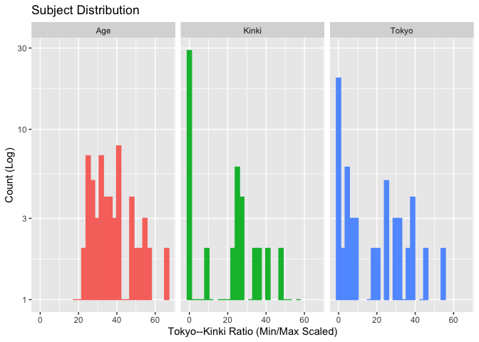
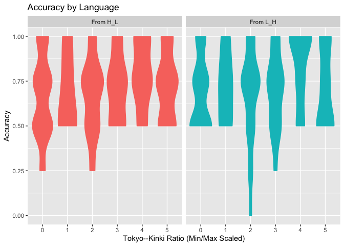
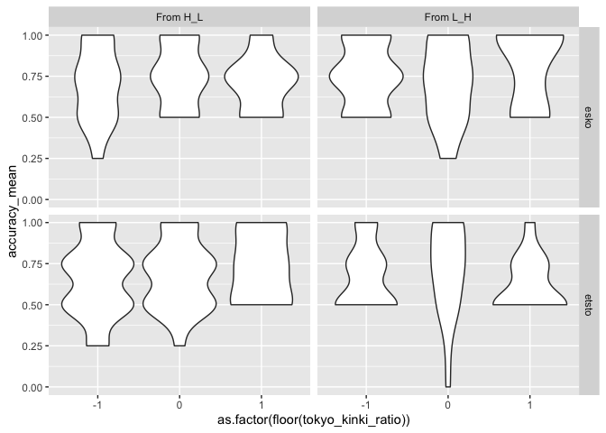

Pitch Mean
================

-   回答の正答率の平均
-   被験者情報

### データ整形

``` r
head(results_by_subject)
```

    ## # A tibble: 6 x 21
    ##   run_id data_src item  accuracy_mean phoneme pitch_from voiced subj_id input_id
    ##    <dbl> <chr>    <chr>         <dbl> <chr>   <chr>       <dbl> <chr>   <chr>   
    ## 1    152 cw       etst…          0.75 etsto   From H_L   0.0417 152_ru… rurusie…
    ## 2    152 cw       esko…          0.5  esko    From H_L   0.0417 152_ru… rurusie…
    ## 3    152 cw       etst…          0.5  etsto   From L_H   0.0417 152_ru… rurusie…
    ## 4    152 cw       esko…          1    esko    From L_H   0.0417 152_ru… rurusie…
    ## 5    128 sone     etst…          1    etsto   From H_L   0.167  128_00… 0009    
    ## 6    128 sone     esko…          0.75 esko    From H_L   0.167  128_00… 0009    
    ## # … with 12 more variables: span_tokyo <dbl>, span_kinki <dbl>, age <dbl>,
    ## #   span_unknown <dbl>, devoiced <dbl>, span_tokyo_span_kinki <dbl>,
    ## #   span_tokyo_span_other <dbl>, span_kinki_span_tokyo <dbl>,
    ## #   span_kinki_span_other <dbl>, tokyo_kinki_ratio <dbl>,
    ## #   tokyo_other_ratio <dbl>, tokyo_ratio <dbl>

## 可視化

### 被験者の分布

``` r
results_by_subject %>%
  select(c(subj_id, age, span_tokyo, span_kinki)) %>%
  distinct() %>%
  nrow()
```

    ## [1] 62

``` r
results_by_subject %>%
  select(c(subj_id, age, span_tokyo, span_kinki)) %>%
  distinct() %>%
  mutate(
    x_age = as.integer(age),
    x_span_tokyo = as.integer(span_tokyo),
    x_kinki = as.integer(span_kinki),
  ) %>%
  pivot_longer(cols = starts_with("x_"), names_to = "x_name", values_to = "x_value") %>%
  mutate(x_name = case_when(
    x_name == "x_age" ~ "Age",
    x_name == "x_span_tokyo" ~ "Tokyo",
    x_name == "x_kinki" ~ "Kinki"
  )) %>%
  ggplot() +
  facet_grid(. ~ x_name) +
  geom_histogram(aes(x = x_value, color = x_name, fill = x_name)) +
  scale_y_log10() +
  theme(legend.position = "none") +
  labs(
    title = "Subject Distribution",
    x = "Tokyo--Kinki Ratio (Min/Max Scaled)",
    y = "Count (Log)",
    color = "Label",
    fill = "Label"
  )
```

    ## `stat_bin()` using `bins = 30`. Pick better value with `binwidth`.

    ## Warning: Transformation introduced infinite values in continuous y-axis

    ## Warning: Removed 34 rows containing missing values (geom_bar).

<!-- -->

``` r
ggsave(paste0("artifact/subject_dist.png"), unit = "cm", width = 8, height = 4)
```

    ## `stat_bin()` using `bins = 30`. Pick better value with `binwidth`.

    ## Warning: Transformation introduced infinite values in continuous y-axis

    ## Warning: Removed 34 rows containing missing values (geom_bar).

### 正答率

1.  基本情報(results\_pitch):
    被験者間実験なので分散が大きい(Appendix行き)

-   条件ごとの精度
-   被験者ごとの精度
-   アイテムごとの精度

1.  統計(results\_by\_subject)

``` r
g <- results_by_subject %>%
  group_by(phoneme, pitch_from, subj_id) %>%
  ggplot() +
  facet_grid(. ~ pitch_from) +
  geom_violin(aes(
    x = factor(range01(tokyo_kinki_ratio), 5),
    y = accuracy_mean,
    color = pitch_from, fill = pitch_from
  )) +
  theme(legend.position = "none") +
  labs(
    title = "Accuracy by Language",
    x = "Tokyo--Kinki Ratio (Min/Max Scaled)",
    y = "Accuracy"
  )

ggsave(paste0("artifact/accuracy_by_tokyo_kinki_ratio.png"), g,
  unit = "cm", width = 8, height = 4
)
g
```

<!-- -->

``` r
results_by_subject %>%
  ggplot() +
  facet_grid(phoneme ~ pitch_from) +
  # geom_violin(aes(x=as.factor(floor(span_tokyo/age/0.1)), y=accuracy_mean)))
  geom_violin(aes(x = as.factor(floor(tokyo_kinki_ratio)), y = accuracy_mean))
```

<!-- -->

### 統計分析

``` r
# 年齢で標準化すると効果がでるのか...ちょっと行儀わるいけど
# summary(lm(to_tokyo_pattern~scale(span_tokyo/age)+pitch_from, results_by_subject))
library(lme4)
```

    ## Loading required package: Matrix

    ## 
    ## Attaching package: 'Matrix'

    ## The following objects are masked from 'package:tidyr':
    ## 
    ##     expand, pack, unpack

``` r
library(lmerTest)
```

    ## 
    ## Attaching package: 'lmerTest'

    ## The following object is masked from 'package:lme4':
    ## 
    ##     lmer

    ## The following object is masked from 'package:stats':
    ## 
    ##     step

``` r
formula_list <- c(
  accuracy_mean ~ scale(span_tokyo / age) + pitch_from,
  accuracy_mean ~ scale(span_tokyo / age) + pitch_from
)

summary(lmer(accuracy_mean ~
               scale(span_tokyo / age) + pitch_from +
               (1 | subj_id) + (1 | phoneme),
             results_by_subject))
```

    ## Linear mixed model fit by REML. t-tests use Satterthwaite's method [
    ## lmerModLmerTest]
    ## Formula: accuracy_mean ~ scale(span_tokyo/age) + pitch_from + (1 | subj_id) +  
    ##     (1 | phoneme)
    ##    Data: results_by_subject
    ## 
    ## REML criterion at convergence: -54.1
    ## 
    ## Scaled residuals: 
    ##      Min       1Q   Median       3Q      Max 
    ## -3.00957 -0.77411  0.03818  0.72481  1.72040 
    ## 
    ## Random effects:
    ##  Groups   Name        Variance Std.Dev.
    ##  subj_id  (Intercept) 0.008175 0.09042 
    ##  phoneme  (Intercept) 0.001290 0.03592 
    ##  Residual             0.037600 0.19391 
    ## Number of obs: 248, groups:  subj_id, 62; phoneme, 2
    ## 
    ## Fixed effects:
    ##                        Estimate Std. Error        df t value Pr(>|t|)   
    ## (Intercept)             0.69758    0.03287   1.83435  21.225  0.00331 **
    ## scale(span_tokyo/age)   0.03173    0.01687  60.00000   1.881  0.06488 . 
    ## pitch_fromFrom L_H      0.01210    0.02463 184.00000   0.491  0.62386   
    ## ---
    ## Signif. codes:  0 '***' 0.001 '**' 0.01 '*' 0.05 '.' 0.1 ' ' 1
    ## 
    ## Correlation of Fixed Effects:
    ##             (Intr) sc(_/)
    ## scl(spn_t/)  0.000       
    ## ptch_frFL_H -0.375  0.000

``` r
results_by_subject
```

    ## # A tibble: 248 x 21
    ##    run_id data_src item  accuracy_mean phoneme pitch_from voiced subj_id
    ##     <dbl> <chr>    <chr>         <dbl> <chr>   <chr>       <dbl> <chr>  
    ##  1    152 cw       etst…          0.75 etsto   From H_L   0.0417 152_ru…
    ##  2    152 cw       esko…          0.5  esko    From H_L   0.0417 152_ru…
    ##  3    152 cw       etst…          0.5  etsto   From L_H   0.0417 152_ru…
    ##  4    152 cw       esko…          1    esko    From L_H   0.0417 152_ru…
    ##  5    128 sone     etst…          1    etsto   From H_L   0.167  128_00…
    ##  6    128 sone     esko…          0.75 esko    From H_L   0.167  128_00…
    ##  7    128 sone     etst…          0.75 etsto   From L_H   0.167  128_00…
    ##  8    128 sone     esko…          1    esko    From L_H   0.167  128_00…
    ##  9     45 cw       etst…          0.75 etsto   From H_L   0.208  45_りりな…
    ## 10     45 cw       esko…          0.75 esko    From H_L   0.208  45_りりな…
    ## # … with 238 more rows, and 13 more variables: input_id <chr>,
    ## #   span_tokyo <dbl>, span_kinki <dbl>, age <dbl>, span_unknown <dbl>,
    ## #   devoiced <dbl>, span_tokyo_span_kinki <dbl>, span_tokyo_span_other <dbl>,
    ## #   span_kinki_span_tokyo <dbl>, span_kinki_span_other <dbl>,
    ## #   tokyo_kinki_ratio <dbl>, tokyo_other_ratio <dbl>, tokyo_ratio <dbl>

``` r
print("EOF")
```

    ## [1] "EOF"
